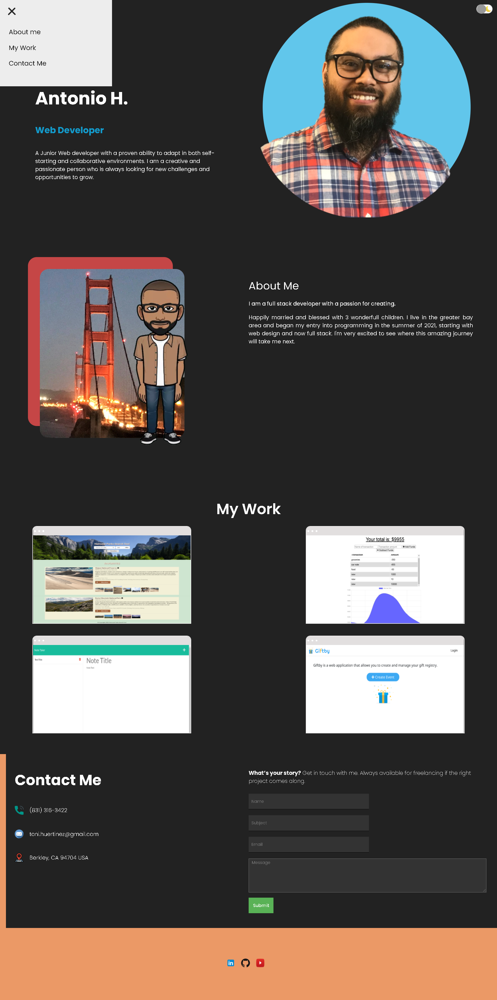

<h1> React Portfolio </h1>

  

## Table of Contents 

- [Description](#description)
- [Screenshot](#screenshot)
- [Deployed](#deployed)
- [Technologies](#technologies)
- [License](#license)
- [Questions](#questions)

 

## Description

### A React portfolio that gives a little introduction about me, some work I've done and a way to contact me directly.

 

## Screenshot

 

# Deployed:

https://tonycodesnow.github.io/React-Portfolio/

 

## Technologies:
- [React](https://reactjs.org/)
- [React-Router](https://reacttraining.com/react-router/web/guides/quick-start)
- [Express](https://expressjs.com/)
- [Node.js](https://nodejs.org/)
- [Git](https://git-scm.com/)
- [javascript](https://developer.mozilla.org/en-US/docs/Web/JavaScript)
- [HTML](https://developer.mozilla.org/en-US/docs/Web/HTML)
- [CSS](https://developer.mozilla.org/en-US/docs/Web/CSS)
- [Emailjs](https://www.emailjs.com/)

 

## License

This project is licensed under the GNU license. 

 

## Questions?

If you have any questions, contact me at: 
tony.huertinez@gmail.com   
Check out my other work at GitHUb:
[antoniohuerta](https://github.com/Tonycodesnow)  